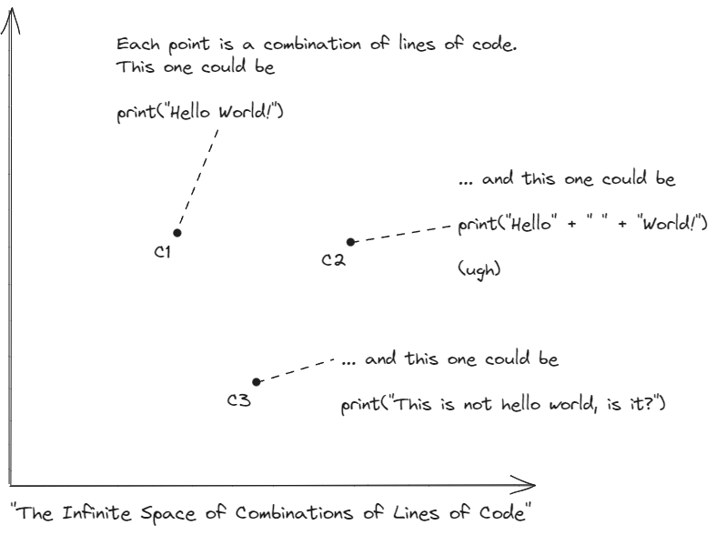
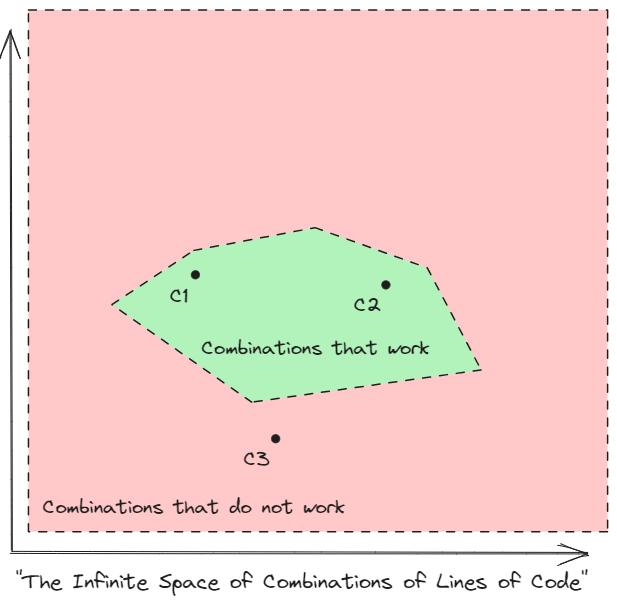
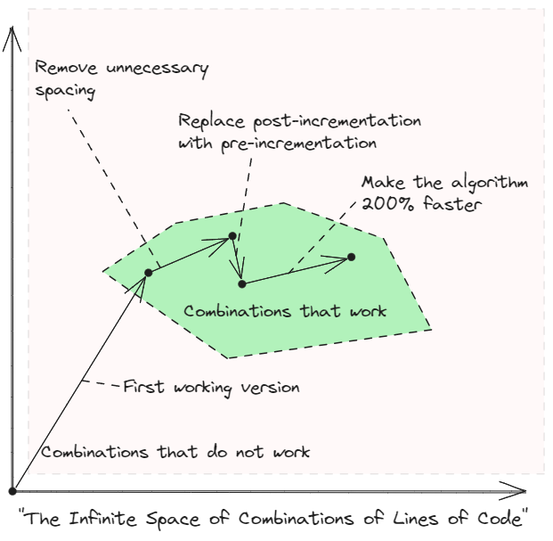

# TL;DR

* We often think of code as something that is *constructed*, but what if we imagined it is *found*?
* Each version of a codebase can be understood as a point in a space containing all possible combinations of possible codebases.
* Coding and changes to code can thus be understood as a way of searching for an acceptable solution in that infinite space, even among solutions that perform the same function.

# The Nature of Code

Coders create code.

That's the sort of axiom one can throw around at any given gathering and reasonably expect to make it out of said gathering alive. No one, to the best of my knowledge, was ever denied service at a pub or kicked out of a house party for the bold claim that code is created by coders.

We can think of this as a process of *construction*. Someone sits down -- unless they use a fancy standing desk, in which case I suppose they stand up -- rolls up their metaphorical sleeves, and gets to solving problems. For each problem, a solution is thought up in the magical squishiness of the human brain, and then painstakingly translated into a sequence of characters that can be understood both by the magical squishy and the no-less-magical silicon that inhabits most of our everyday objects.

This constructive, bottom-up principle of how code is put into files leads to all sorts of emerging patterns, anti-patterns, dialects, a whole ecosystem of ideas, implications, explicit and implicit relationships, which all brought together encode some sort of functionality. Code can be vastly complex or devastatingly simple, the product of a single developer coding late at night between dinner and bed, or the collaborative output of hundreds of developers who code professionally.

But code is, at its very core, just a collection of files, all placed in their correct directories, each of them containing a few, or many, lines of characters -- or as in most instances of `__init__.py`, just nothing. This means that code is deliciously fungible; if the sequence of characters and arrangement of files is the same, code can be copied around and will remain valid. What this means is that a *version* of a codebase is a singular, unique, atomic representation of all of that time, effort, brainpower, and creativity poured into it by developers. A version of a codebase is, as I will soon try to convince you, a single point in a space.

The goal of this essay (or any of its successors) is not to change your opinion on the fundamental nature of software engineering. It is not, even, to change your opinion at all. This essay is an exercise in making sense of things, of trying to abstract away the entire process of designing, writing, refining, discussing, reviewing, testing, accepting code into a logical nucleus that can be used as a shared understanding of how software evolves, how it *should* evolve, and how it sometimes is prevented from evolving.

And it all starts with a single idea: we can all accept that code is *constructed.* But what if I proposed, for a second, that code is instead *found*?

# The Delicious Fungibility of Code

Before we proceed much further, let's nail down the idea of functional equivalence.

Prepare to be aggravated.

If I wanted to build a program that fulfilled the requirement

> Print out the string "Hello World!"

I could do so in several ways:

```python
# Option 1
print("Hello World!")

# Option 2
print("Hello" + " " + "World!")

# Option 3
print("Hello ", end="")
print("World!")

# Option 4
for letter : "Hello World!":
    print(letter, end="")
print()

# Option 5 (trigger warning)
import some_optimisation_library
obj_func = some_optimisation_library.cost(hypothesis - "Hello World!")
print(some_optimisation_library.optimise(obj_func))
```

Now we can argue for and against all of these until we're blue in the face, and I am sure that that would be an -- *ahem* -- interesting exercise, but for now allow me to convince you that all of these are *functionally equivalent*, i.e., if we define that the software should deliver some concrete, measurable thing -- in this case printing out a certain string -- then all of these solutions are equally capable of delivering that functionality. 

Perhaps more concretely, if I were to write a unit test against a function that were implemented in one of these ways, then the test would pass regardless of which implementation we select from the list above, and thus they are *functionally equivalent*.

This does not mean that they are all acceptable, and we can make solutions become *not* equivalent by changing their requirements. If I amend the requirement above from

> Print out the string "Hello World!".

to

> Print out the string "Hello World!" in a way that does not make me want to invert the direction food travels through my body.

then we could immediately rule out a few of the solutions above as not being acceptable.

For the moment, though, let's simply accept that, for the purposes of this discussion, they are *different* things that perform *the same* function. They are *functionally equivalent.*

# Code as a Point in an Infinite Space

The thesis is, then, something to the tune of

> The expressive power of a given programming language is essentially infinite, which means that for any given problem, a programming language will be able to solve it in infinite functionally-equivalent different ways.

meaning that some code, any code, is simply one of many ways of solving a given problem, which in principle is solve-able in an infinite number of ways.

(Dear Mathematicians: I am using a purposefully vague definition of "infinite". In practice, I don't think that a programming language can have _strictly_ infinite expressive power, if nothing else because there will be no infinite storage space to store the code. However, in engineering, much like pi = 3.1416, we take "infinite" to just mean "such a vast amount that we can't realistically be bothered to count." Thank you for your understanding.)

Bear in mind that in order to achieve this formulation, I am defining that *any* change to a codebase constitutes a new version of the entire codebase; if I were to change something as small as an invisible character somewhere in a configuration file, that would constitute a new version of the code. This is consistent with widely-accepted views of version control; for instance in git, any little change results in a commit with a different hash, and even if the commit is amended, it is re-hashed and is, therefore, not the same commit.

We can now imagine a space where each point in that space is a combination of lines of code (or characters, up to you, the metaphor works either way), i.e. a version of the code. If we project this space into 2D, as I am not good at drawing in infinitely-dimensional spaces, this would look roughly like this:



That space will be naturally segmented into two main regions: the region of solutions that *work*, i.e. the solutions that perform the intended function, and the region of solutions that *do not* work. While all of the solutions in the previous section would lie in the region of solutions that work, C3, i.e.

```python
print("This is not hello world, is it?")
```

would lie in the region of solutions that *do not* work, as it does not deliver the functionality we want.

The segmented space would look something like this:



with functional solutions falling on the functional region of space ("Combinations that work"), and non-functional solutions out of it. Barring extremely simple problems, the solutions that work will be immersed in a sea of solutions that do not work.

Now, developing code is a naturally iterative process. It is very difficult to write a usable, acceptable solution at the first attempt -- kudos to anyone who can, I certainly can't -- and, as such, it becomes necessary to make changes.

The apparently most widely-accepted means of doing this in modern software development is to take a codebase, branch out of it, and then submit a changelist for review, approval, and integration into the original codebase. This is called the feature branch workflow, and I will assume it to be the methodology we're using henceforth. That is certainly not necessarily the case, but when discussing review, changes, and integration of changelists in a codebase, it is certainly simpler to refer consistently to the same workflow.

So, after we've found a first solution, we then need to drive it towards something that can either be accepted into a wider codebase we're working on, or that we are willing to accept ourselves. This, in its simplest incarnation, takes the form of performing simple tasks such as linting, minor file reorganisation, etc. In its less-simple incarnations, this stage can be as complicated as refactoring the entire change/changelist.

Regardless of complexity, however, these actions always have the same meaning from the perspective of this framework: they are movement of the codebase in a direction we want it to move, within the region of solutions that work:



Each individual solution, each individual point in that plot, is functionally equivalent to all others that lie in the functional region. However, they differ in non-functional aspects, which can be important for acceptability. We will discuss this at length later, so for now it is enough to understand and accept this idea of movement within the functional region.

# How to Find a Needle in a Haystack

In order to better cement the idea above -- and because I'm a practical guy above all else -- let's look at the process of developing a new piece of code from the perspective of the concepts discussed above.

We start by defining some requirements and, armed with those, we start banging our heads on the nearest wall, trying to think of a way of solving the problem at hand. This can take the form of design sessions, discussion with colleagues, rolling a dice, consulting the nearest witch, etc. It is at this point that I usually encourage people to think outside the box, to imagine a perfect world made of round cows in the vacuum of interplanetary space, and avoid -- within reason -- constraining the engineering process to non-functional rules and requirements. Finding the first solution can, and sometimes should, be an imaginative shot in the dark.

Once we have a semblance of how we're going to solve the problem at hand, we get to coding something that will work, and that will be our *first functional version.* The first point in our space. Sometimes this point is far outside acceptability, sometimes it lies in its vicinity, somewhat rarely something will come up that is readily acceptable. That all depends on the engineer's skill, experience, familiarity with the culture of the organisation, familiarity with the prevailing architectural direction, familiarity with the standards in place, and, not to a trivial degree, sheer dumb luck.

Now at this point, the problem is solved. We have understood the problem, we have produced a solution, and now we go away. We're done. Finito.

... right?

Well, no. Sorry.

Once the first solution is in place, i.e. once we have a really janky prototype that at least vaguely solves the problem, then we need to clearly define the region of acceptable solutions and the steps we must take to reach it. This can be as simples as:

* Unit test coverage must be >95% -> We must write unit tests.
* The code must conform to PEP-8 -> We must run flake8 and have a fight with it.
* The code must run in less than Xms -> We must make the code faster.
* etc

We can then apply each of these changes iteratively, usually picking a convenient order that minimises the overall number of changes and/or damage to the developer's will to live. Each of these changes yields a new version of the software which, as seen in the figure above, will be a new point in our infinite space. Each change pushes the point in a slightly different direction, ideally in a consistent direction that will bring it in line with the overall desired architectural intent (more on that later).

At some junction, that point will lie in a region that all of the stakeholders involved -- even if just the developer -- will find acceptable. At that point the changelist is approved, integrated into the codebase, and we move on to the next problem.

# Kinds of Coders are Kinds of Searchers

You will notice that the previous section is almost a direct reinterpretation of the old adage

>Make it work, make it right, make it fast.

That is not an accident. From my perspective, what I am enunciating here is little more than a generalisation of that principle, but re-interpreted. We "make it work" by finding a solution in the functional region, and then we "make it right", "make it fast", make it whatever other things it needs to be in order to be acceptable, by moving the solution along that region, ideally never straying too far outside of it.

This way of thinking is not groundbreaking, does not introduce any gigantic novelty into the world of Software Engineering, nor does it solve any of the many, many problems with modern software. Try as I might, I can't even get this essay to pour a nice espresso.

So what's the point?

As I mentioned before, this is an exercise in making sense of things. This may all read trivial to anyone who has not dealt with large codebases -- and large codebases are much of the motivation for this -- but for those who have, I hope we all identify with the feeling of lacking direction and grasp of the system as a whole. When something is made of several thousand moving parts, dozens of submodules, maybe a few too many (hundreds of thousands of) lines of code, it is very easy to become lost in the middle of it all.

Thinking of the code in terms of a point in a space lends some geometrical interpretation to the daunting concept of understanding -- or worse changing, or even worse, architecting -- code that exists in a large codebase. As we shall see below, this comes with a number of interesting (to me) corollaries:

* Code review becomes a team effort in moving that point towards somewhere more agreeable;
* Architecting becomes an exercise in defining the boundaries where the point can exist, and in which direction it needs to move;
* Failures in development and architecture seem to translate well into this metaphor, as do the steps that can be taken in mitigating them, as we shall see below.

This framework also helps me characterise some of the various ways of coding people use, and thus better guide others in writing software. For instance, I tend to define people's methodologies in refining code, post finding the first functional solution but before integration into the codebase, in two great groups:

* Those who take small leaps, and spend little time outside the functional zone;
* Those who take larger leaps, and are not bothered with spending more time outside the functional zone.

The former are people, such as myself, who strive to build functionality first, and once it is built, tend to avoid breaking it in the process of reaching another, better, still functional solution. This is akin to taking paths along the green region, avoiding straying too far from it.

The latter are people who will happily refactor an entire PR to better fit a different architectural vision, with no regard to how well the code works in the interim. This is akin to taking paths that stray further outside the functional region.

These two ways of working (and this is not an exclusive list by any means) are extremely well described by this framework, and using it to explain the process of coding to younger engineers, usually by means of a pen and paper, has worked very well for me in the past.

# Conclusion

In this somewhat long-winded essay, we have explored the concept of functional equivalence, and leveraged it to introduce the idea that a version of a codebase can be interpreted a point in some abstract, infinite space. Then, as we are gluttons for punishment, we went ahead and tried to rationalise the process of coding around this concept.

In the near future, we shall apply this concept in a myriad of ways in the context of engineering software in a team.

# Further Reading

References on the feature branch workflow:

* https://git-scm.com/book/en/v2/Git-Branching-Branching-Workflows
* https://www.atlassian.com/git/tutorials/comparing-workflows/feature-branch-workflow