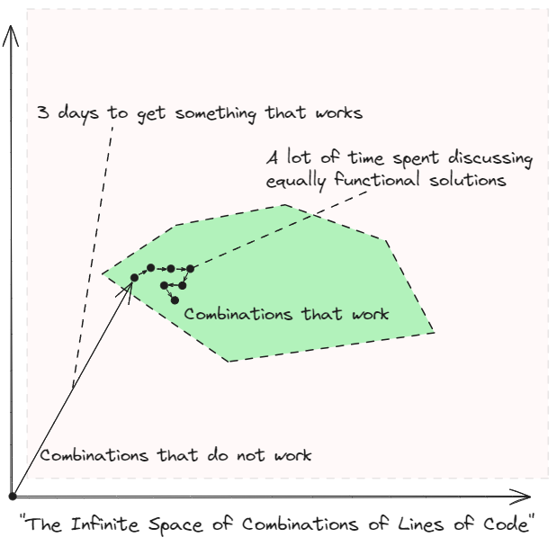
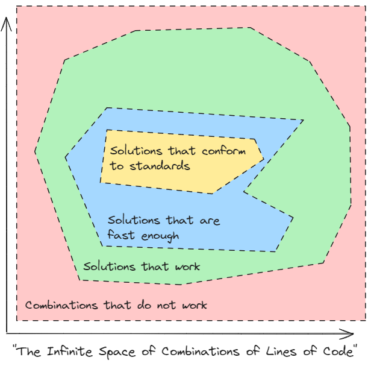
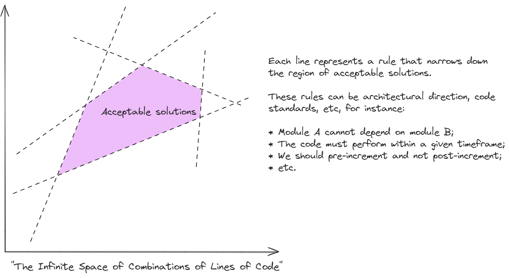
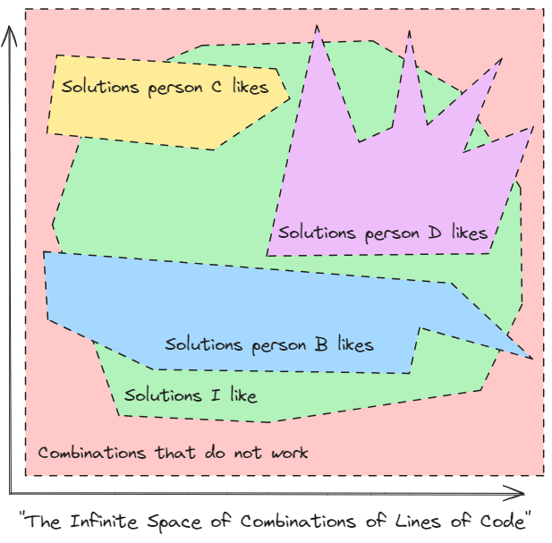
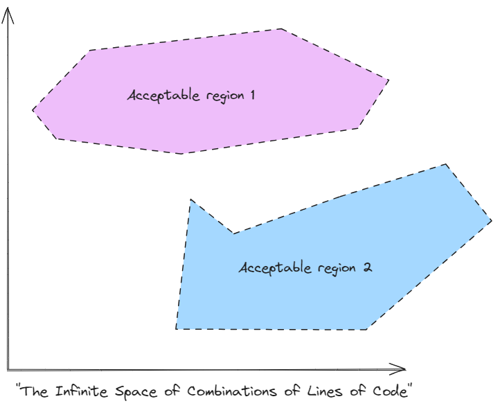
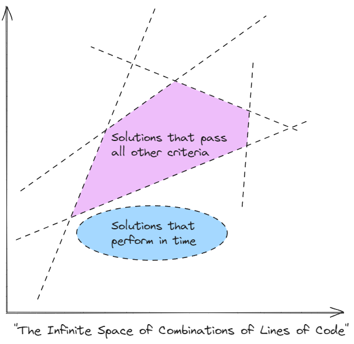
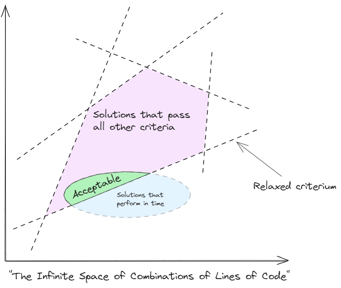

# TL;DR
* If code is "infinitely" expressive, then there's infinite ways of doing anything.
* This can lead to inefficient ways of working, wherein we spend a lot of time producing very little value.
* We can use architecture and coding guidelines to better define acceptable space, making it much easier to produce acceptable solutions.
* There's a bunch of caveats to this, so we'll examine a few.

# Developers are Always in Good Company

I used to think that rules and guidance regarding development were a "thing for organisations", a necessary evil of sorts that plagued any development environment with more than one developer. This is an obviously silly notion that can be easily illustrated with my own failings. I often code in my spare time, not because I particularly enjoy it, but because I find myself enjoying things that greatly benefit from a bit of custom code here and there.

* Need to plan weights and reps for my workouts? Sounds like a Python job.
* Need to keep track of my personal finances? Sounds like a Python job.
* Need to turn haphazard collections of markdown files into organised, readable manuscripts and collections of essays? Sounds like a Python job.
* ...

In these cases, I tend to prioritise ease of development above all else, and end up producing horrendous code, often written in both English and Portuguese, with absolutely calamitous formatting, dependencies, you name it, I do it wrong. Then, when I'm done, I think to myself

"Ah, it's okay. It's just for myself."

then go to bed and sleep easy.

The problem is that we're never really alone in development, philosophical notions aside, because the truth is that the guy who wrote that code 3 weeks ago and the guy reading it now are two different people, in two different contexts, possibly very different states of mind. And the latter of the two is tremendously pissed off at the first, because he's having to spend much of his scarce free time working out what the hell that code is supposed to do.

So, I now code to guidelines I impose myself, and present me thanks past me for that.

On the other hand, though, I personally dislike working in overly-prescriptive environments, not just because I'm a ~~narcissist who refuses to listen to anyone else~~ strong-minded individual, but also because I'm keenly aware -- I tell myself -- of the fallacious nature of appeal to authority.

For me, this takes two forms. Firstly, I think it's a bad idea to accept anyone's opinion just because of who they are; I believe that technical guidance needs to exist in a well-justified, widely-understood manner, if nothing else because it is much, much easier to enforce guidance if people understand and accept it. Secondly, and perhaps most importantly, I openly admit that I am wrong *most of the time*, and thus despise being on the "receiving" end of appeal to authority; I do not like to be an authority to be appealed to, and instead prefer to produce guidance with solid justification, taking feedback and criticism as a means to improve. I'd even do it anonymously, if I could.

The point is that guidance, regardless of whether or not we like it, is a necessary element of modern software development. Otherwise, there will be no common language for developers to work on, no common understanding of what is and isn't acceptable, the codebase becomes chaos, and our velocity grinds to a halt. There are many ways our velocity can grind to a halt, but poor guidance is one of the silliest.

# Infinity Costs Precious Development Time

We've seen that we can think of [Code as a Point in an Infinite Space](<0010 - Code as a Point in an Infinite Space>), and we have also seen how we can find a solution within that infinite space. We've also seen how changing the code is moving that point in *some* direction. We shall now discuss why and how to define what that direction should be, and as usual we will do so through an example.

At any point, we can get dragged into a discussion where someone says

> `++i` is better because \<insert inscrutable C++ reason\>

and someone else goes

> but `i++` is a better logical representation because \<insert personal anecdote\>

and before you know it, you're 25 comments deep into a discussion that will yield a grand total of zero useful contribution to the work at hand. We've all been there.

This feels pointless for most of us, nitpicking on code down to that level of detail. It feels like something that should be done *for* us, not *by* us. It doesn't take the human intellect to decide whether to pre-increment or post-increment; it takes a human to decide which kind should be used in general, and then actually doing it should be automatic, for the same reasons I'm typing on a keyboard instead of touching wires together to tell my computer which characters I want. We do not need to solve the fundamental problems over and over again; we need to agree on a solution and move on with our collective lives.

Within this framework of mine, though, we can give this feeling a visual representation:

Now I'm not here to debate the benefits of pre-incrementation -- no way I'm getting dragged into that one -- but I think we can all recognise that having this sort of discussion repeatedly will slow the work down and cause unnecessary friction between developers. Before you know it, developers will be split into "team pre-increment" and "team post-increment", and the daily NERF battles will absolutely destroy productivity at the office, and possibly some expensive equipment.

So what do we do?

We pre-decide that shit.

We define rules.

Only once.

(And never talk about it again.)

# Cutting Down on Solutions

I have thus far used words like "guidelines" and "rules" but I actually mean two concrete kinds of rules we traditionally use when engineering software at scale.

The first, and simplest, are coding standards (or coding guidelines). These take can take the form of a simple cheat sheet or, even better, linting software that deals with all of the annoying crap we have to think about, such as line lengths, line breaking rules, naming conventions, etc etc etc.

The second, and most important, is something I will refer to as "architectural direction". 

(Software architecture is a whole vast field of study which cannot be described in the context of a series of short essays, lest that series turn into a few books, but I shall nevertheless try.)

Software architecture defines a system in terms of the conceptual modules, their interfaces and, to some extent, their physical implementation, and how all of that should coalesce into a functioning system. This means that the architecture is responsible for telling developers, essentially, where things go, how they should function, and how they should talk to one another. Architecture can also be defined in fuzzier terms, a vision which is hard to make concrete at the outset and instead must be used to guide decisions throughout the software's lifetime.

Simple, right?

(Sure, let's go with that.)

Crucially for this discussion, standards and architecture also have the power to preempt pointless discussion and wasted effort by deciding a priori which way is "best" in a consistent way across the codebase, giving people clear guidance on how certain topics should be addressed. This means that there is no reason for the infinite space of code to be split only into functional and non-functional regions. Here's a few more regions:

Defining these regions and how they intersect is the role of standards and architecture. Rule upon rule, we define region after region after region, and if we do this iteratively, taking the intersection of all regions, this has the effect of narrowing down the region of acceptable solutions, which can ultimately (in, admittedly, extremes cases) drastically simplify the process of reviewing contributions to a codebase by making clear all of the rules for acceptability. Review is then a check-box exercise: if all the rules pass, then the contribution is acceptable.

In "The Space", this looks something like this:

Crucially, if we're careful in defining these rules, we can define a common region of shared understanding of what the codebase should look like. The benefits of this *cannot* be overstated: reviewing contributions becomes easier, everyone speaks the same language, and discussion about trivialities is reduced to a minimum.

I have never, ever seen development proceed as smoothly as when a whole scrum team had a solid understanding of both the subsystems at hand *and* their intended architectural direction. That state of being empowers developers to work as autonomously as possible without technical guidance until almost the very end of a contribution's lifetime, not only driving up productivity, but also overall morale. I will go as far as saying that establishing a common understanding and architectural direction is *more important* than having especially talented developers, as the effect of clear direction is lowering the barriers of entry to producing contributions, thus maximising the output of developers regardless of talent.

(I look forward to the trouble that that last statement will find me.)

# The Non-Denominational Daemon is in the Details

The problem with everything I wrote above, IMHO, is that it is very hard to make concrete, and very easy to find counter-examples for. So this section materialises some of those thoughts into examples I've found throughout my career, if nothing else to put some meat on the bones of the overall idea.

## Fuzzy Rules, Long Discussions

We can now highlight one of the great dangers of fuzzy architectural direction and vague code standards: they leave space for personal taste. When personal tastes start playing a role -- and I propose that personal taste *will* play a role in any process involving creativity, including coding -- then the region of acceptable solutions can become very very wonky indeed or, even worse, simply not exist, as there may not exist a solution that will make everyone happy.

At that point, we are playing a very dangerous game:

In this particular case, the exercise I would engage in would be to establish consistent patterns that, while not to the taste of everyone -- *nothing* is to the taste of everyone -- are at least *functional*, *usable*, and *enforceable*. The best case is when something is enforceable via tooling (e.g. linting), but if not, then enshrinement in architectural documentation is the way.

The key takeaway, though, is that architectural direction and coding guidelines *do not* have to please everyone, lest they become over-complicated or inapplicable. They should, however, be well documented and grounded in sound technical reasoning. If we go back to the pre-increment example above -- and assuming there is no functional difference -- then what we should do in that case is make a decision and stick with it, ensuring that the codebase is kept consistent and, thus, readable and maintainable. Whichever way we go will make *someone* unhappy, but we will have a consistent, maintainable codebase, and that is more important than feelings.

## The Pitfalls of Dis-jointed-ness

Even without personal taste being involved, and depending on the rules at play, we may end up in a situation where there are several dis-jointed regions of acceptable solutions:

In practice, this is equivalent to, for instance, having two equivalent class layouts for the same solution, both of equal architectural value, computational performance, etc; they just happen to be two different arrangements of classes that give us the same value, being equally valid from every other perspective.

This case is very hard to predict, particularly in very large codebases, even more if their architectural direction is somewhat vague -- and you see where I'm going with this. 

These cases are a shiny opportunity to review the architectural direction of the system and to try to generalise guidance that will prevent this situation from happening at all in the future. Save for massively complicated projects (and we shall talk about massively complicated projects in the future), it *should* be possible to produce architectural guidance that avoids these cases to a reasonable degree.

"But Gonçalo," I hear you screaming at your phone, "it is utterly impossible for an architect to predict all possible cases!"

And that would indeed be true, no one can predict infinite cases. So in addition to reviewing our architectural direction, at this point we need to make a choice on which solution to go with. This decision falls, in my opinion, on the software architect; they own the vision for how the software should progress, and thus should play ultimate arbiter in this sort of decision. It also falls on the architect to then generalise that decision, if possible, into a well-documented architecture document.

## Sorry, nothing is acceptable

Now in a somewhat opposite direction, we may also end up in a situation where there is no acceptable region.

This is hard to think of in completely abstract terms, so let's materialise. Imagine we need to write a function that computes where a ball shot from a cannon will land, taking into account Earth gravity, Moon gravity, fluid dynamics with air, and perhaps some other stuff I can't think of at the moment. Let's imagine that we also want this algorithm to run in less than X ms, say, for platform reasons.

These requirements may very well simply be incompatible: it may be impossible -- save for inventing some new mathematics or heuristics -- to accurately simulate the ball's trajectory within the given timeframe:

In this case, we have posed the developer an ill-formed problem with no solution, and we are about to have a very unhappy developer. Since unhappy developers are slow developers that write shoddy code, we should strive to prevent this. The way we prevent this is to iterate on the architecture; again, *change the rules*. In this case, we could relax either the accuracy requirements or the runtime requirements to find an acceptable region:

In much the same way as the cases above, solving this problem would require changing the requirements of the system or its architectural direction, and at this point *consistency* plays a role (more on that in a second).

## The Slippery Slope of Moving-Target Architecture

In all of the cases above, my proposed solutions all seem to fall within the vague persuasion of "improve architecture" or "change the rules".

Well, yes. I would argue that finding that we have mis-defined the problem is a failure in architecture and that we, as software architects, need to set out the rules of play that define acceptability and drive consistency across the codebase, and do it in such a way that success is at least *possible*.

This is not, however, necessarily a bad thing. Software architecture is in itself, as is anything else in software engineering, an iterative process. No one has the ability to predict every single possible solution to a problem, particularly if we accept that they are infinite. Architecture should, thus, self-improve to support development in the most efficient way possible.

And then there's consistency.

Whenever the rules of play are changed, e.g. when we change the definition of acceptable code, it is important that these rules are clearly enforced throughout the codebase in upcoming work, or at least taken into account and work planned accordingly to rectify existing code.

At this point we would need to discuss the value of patterns, which we will do in a future essay as this one is already too long.

I will mention, however, that in my opinion we should not allow changes in architectural direction to hold back the acceptance of contributions which *would* be acceptable in the previous case, provided these are already in flight. This principle generalises very, very badly, reads a lot like sunk-cost fallacy, and finding counterexamples is extremely easy, but bear with me.

If there is a need to change architectural direction when a change in in flight, then that can be seen as an independent piece of work to be taken on by the architect/architecture team, as the architecture needs to be refined. This then necessarily leads to other pieces of work to be defined to rectify the existing architecture, but in the meantime we would get the intended functionality out of the change in flight. In this case, we would have to eat the cost of not predicting a certain case in the form of extra rectification work across the codebase, which is a foreseeable cost in software engineering.

# Conclusion

In this essay, we have discussed how code standards and software architecture play a role in defining the region of acceptability for code changes. We then went on to discuss various corner cases where the region can be severely ill-defined, and how they can be ameliorated.

You may have noticed that I've avoided going into detail on a few tangential topics. These will be the subject of their own essays.

# Further Reading

- If nothing else because I like it, here's a cool website on the topic of design patterns: https://refactoring.guru/design-patterns
- I'm also of the opinion that pretty much anyone who works on software should read The Mythical Man-Month at least once: https://en.wikipedia.org/wiki/The_Mythical_Man-Month